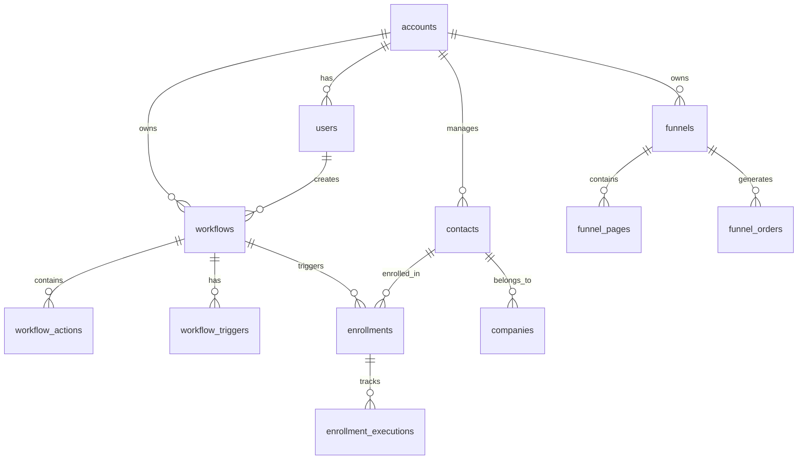

# 📚 GoHighLevel Clone - Wiki Técnica

**Última actualización:** 2026-02-07
**Versión:** 1.0.0
**Estado:** Production Ready

---

## 📖 Índice

1. [Introducción](#introducción)
2. [Arquitectura del Sistema](#arquitectura-del-sistema)
3. [Guías de Desarrollo](#guías-de-desarrollo)
4. [Backend API Reference](#backend-api-reference)
5. [Frontend Components](#frontend-components)
6. [Database Schema](#database-schema)
7. [Testing](#testing)
8. [Deployment](#deployment)
9. [Troubleshooting](#troubleshooting)
10. [FAQ](#faq)

---

## Introducción

### ¿Qué es GoHighLevel Clone?

Es una plataforma completa de **automatización de marketing y CRM** que permite a las empresas:

- 🔄 **Automatizar workflows** de marketing y ventas
- 👥 **Gestionar contacts** y leads
- 💰 **Track deals** a través de pipelines de ventas
- 📧 **Enviar campaigns** de email y SMS
- 🎯 **Crear funnels** de conversión
- 📅 **Manage appointments** y calendarios
- 📊 **Analizar performance** con dashboards en tiempo real

### Stack Tecnológico

```
┌─────────────────────────────────────────────────────────────┐
│                    FRONTEND LAYER                            │
│  Next.js 14 + React 19 + TypeScript 5 + Shadcn UI          │
│  (40 páginas, 170 componentes, Zustand, TanStack Query)    │
└─────────────────────────────────────────────────────────────┘
                            ↕ HTTP/WebSocket
┌─────────────────────────────────────────────────────────────┐
│                     BACKEND LAYER                             │
│  FastAPI 0.115 + Python 3.12 + SQLAlchemy 2.0               │
│  (300 endpoints, 96 entities, 119 tables)                   │
└─────────────────────────────────────────────────────────────┘
                    ↕                ↕
            ┌───────────┐    ┌────────────┐
            │ PostgreSQL │    │   Redis    │
            │   (Data)   │    │  (Cache)   │
            └───────────┘    └────────────┘
```

---

## Arquitectura del Sistema

### Clean Architecture (4 Capas)

```
┌───────────────────────────────────────────────────────────────┐
│  1. PRESENTATION LAYER                                        │
│  ┌─────────────────────────────────────────────────────────┐   │
│  │ FastAPI Routes (controllers)                            │   │
│  │ - Request/Response DTOs                                 │   │
│  │ - Validation (Pydantic)                                  │   │
│  │ - Middleware (CORS, Auth, Rate Limit)                    │   │
│  └─────────────────────────────────────────────────────────┘   │
└───────────────────────────────────────────────────────────────┘
                            ↕
┌───────────────────────────────────────────────────────────────┐
│  2. APPLICATION LAYER                                         │
│  ┌─────────────────────────────────────────────────────────┐   │
│  │ Use Cases (Orchestrators)                               │   │
│  │ - Business logic coordination                             │   │
│  │ - Entity transformation                                 │   │
│  │ - Transaction management                                │   │
│  └─────────────────────────────────────────────────────────┘   │
└───────────────────────────────────────────────────────────────┘
                            ↕
┌───────────────────────────────────────────────────────────────┐
│  3. DOMAIN LAYER                                              │
│  ┌─────────────────────────────────────────────────────────┐   │
│  │ Entities + Value Objects                                 │   │
│  │ - Business rules (invariants)                            │   │
│  │ - Domain services                                        │   │
│  │ - Repository interfaces                                  │   │
│  └─────────────────────────────────────────────────────────┘   │
└───────────────────────────────────────────────────────────────┘
                            ↕
┌───────────────────────────────────────────────────────────────┐
│  4. INFRASTRUCTURE LAYER                                       │
│  ┌─────────────────────────────────────────────────────────┐   │
│  │ External Systems                                         │   │
│  │ - SQLAlchemy models (DB)                                 │   │
│  │ - Repository implementations                             │   │
│  │ - External API clients                                   │   │
│  └─────────────────────────────────────────────────────────┘   │
└───────────────────────────────────────────────────────────────┘
```

### Principios DDD Aplicados

#### 1. Bounded Contexts
Cada módulo es un **Bounded Context** con su propio lenguaje ubicuo:

- **Workflows**: Trigger, Action, Goal, Enrollment, Execution
- **CRM**: Contact, Company, Deal, Pipeline, Activity, Note
- **Marketing**: Campaign, Email, SMS, Automation, Form
- **Funnels**: Funnel, Page, Element, Order, Integration
- **Calendars**: Calendar, Appointment, Availability, Booking, Widget

#### 2. Aggregates
Cada agregado tiene una **Aggregate Root**:

```python
# Ejemplo: Workflow Aggregate
class Workflow(AggregateRoot):
    """Workflow aggregate root."""

    id: UUID
    account_id: UUID
    name: str
    trigger: Trigger  # Entity
    actions: List[Action]  # Entities
    goals: List[Goal]  # Entities
    version: int

    def add_action(self, action: Action) -> None:
        """Add action to workflow."""
        self.actions.append(action)
        self.version += 1
        self._validate_actions()

    def _validate_actions(self) -> None:
        """Validate business rules."""
        if len(self.actions) > 100:
            raise WorkflowValidationError("Max 100 actions")
```

#### 3. Value Objects
Objetos de valor inmutables:

```python
@dataclass(frozen=True)
class Email(ValueObject):
    """Email value object."""
    value: str

    def __post_init__(self) -> None:
        if not self._is_valid():
            raise EmailValidationError("Invalid email")

    def _is_valid(self) -> bool:
        return re.match(r"^[^@]+@[^@]+\.[^@]+$", self.value) is not None
```

#### 4. Repository Pattern
Interfaces de repositorio en domain layer:

```python
# Domain layer (interface)
class WorkflowRepository(ABC):
    @abstractmethod
    async def save(self, workflow: Workflow) -> Workflow:
        pass

    @abstractmethod
    async def find_by_id(self, id: UUID) -> Workflow | None:
        pass

# Infrastructure layer (implementation)
class SQLAlchemyWorkflowRepository(WorkflowRepository):
    async def save(self, workflow: Workflow) -> Workflow:
        async with self._session():
            self._session.add(workflow)
            await self._session.commit()
            await self._session.refresh(workflow)
            return workflow
```

### Flujo de Datos

```
┌─────────────────────────────────────────────────────────────────┐
│                    REQUEST FLOW                                  │
└─────────────────────────────────────────────────────────────────┘

Client (Browser/Mobile)
    │
    │ HTTP Request (POST /api/v1/workflows)
    │ Headers: Authorization: Bearer <JWT>
    │ Body: { "name": "My Workflow", "trigger": {...} }
    ↓
┌─────────────────────────────────────────────────────────────────┐
│  PRESENTATION LAYER                                             │
│                                                                  │
│  1. CORS Check                                                   │
│  2. JWT Validation → Extract account_id                          │
│  3. Rate Limit Check (Redis)                                     │
│  4. Pydantic Validation (Request DTO)                            │
│  5. Route to appropriate handler                                 │
└─────────────────────────────────────────────────────────────────┘
    │
    │ Validated Request
    ↓
┌─────────────────────────────────────────────────────────────────┐
│  APPLICATION LAYER                                              │
│                                                                  │
│  Use Case: CreateWorkflowUseCase                                │
│                                                                  │
│  1. Load existing workflow (if update)                          │
│  2. Execute domain logic: workflow.create()                     │
│  3. Validate business rules                                     │
│  4. Save via repository                                         │
│  5. Return domain entity                                        │
└─────────────────────────────────────────────────────────────────┘
    │
    │ Domain Entity
    ↓
┌─────────────────────────────────────────────────────────────────┐
│  DOMAIN LAYER                                                    │
│                                                                  │
│  Entity: Workflow                                                │
│                                                                  │
│  1. Validate invariants (name, trigger, etc.)                   │
│  2. Enforce business rules                                      │
│  3. Emit domain events (if any)                                │
└─────────────────────────────────────────────────────────────────┘
    │
    │ Persist
    ↓
┌─────────────────────────────────────────────────────────────────┐
│  INFRASTRUCTURE LAYER                                            │
│                                                                  │
│  Repository: SQLAlchemyWorkflowRepository                       │
│                                                                  │
│  1. Map entity to SQLAlchemy model                             │
│  2. Execute SQL INSERT/UPDATE                                   │
│  3. Return mapped entity                                       │
└─────────────────────────────────────────────────────────────────┘
    │
    │ SQL
    ↓
┌─────────────────────────────────────────────────────────────────┐
│  DATABASE (PostgreSQL)                                          │
│                                                                  │
│  INSERT INTO workflows (...) VALUES (...)                       │
└─────────────────────────────────────────────────────────────────┘
    │
    │ Response
    ↓
Client receives: HTTP 201 Created
Body: { "id": "...", "name": "My Workflow", ... }
```

---

## Guías de Desarrollo

### Setup del Entorno de Desarrollo

#### Prerrequisitos

```bash
# Core tools
Python 3.12+
Node.js 20+
Docker 24+
Docker Compose 2.20+
Git 2.40+

# Optional tools
pgAdmin 4 (PostgreSQL GUI)
RedisInsight (Redis GUI)
Postman (API testing)
```

#### Backend Setup

```bash
# 1. Clonar repositorio
git clone https://github.com/your-repo/gohighlevel-clone.git
cd gohighlevel-clone/backend

# 2. Crear virtual environment
python -m venv .venv
source .venv/bin/activate  # Linux/Mac
# .venv\Scripts\activate   # Windows

# 3. Instalar dependencias
pip install -e ".[dev]"

# 4. Configurar variables de entorno
cp .env.example .env
# Editar .env con tus configuraciones

# 5. Ejecutar migraciones
alembic upgrade head

# 6. Iniciar servidor
uvicorn src.main:app --reload --host 0.0.0.0 --port 8000

# 7. Verificar API
curl http://localhost:8000/health
```

#### Frontend Setup

```bash
# 1. Navegar al directorio frontend
cd gohighlevel-clone/frontend

# 2. Instalar dependencias
npm install

# 3. Configurar variables de entorno
cp .env.example .env.local
# Editar .env.local

# 4. Iniciar servidor de desarrollo
npm run dev

# 5. Verificar aplicación
open http://localhost:3000
```

### Patrones de Código

#### Backend Pattern: Create Use Case

```python
# 1. Define Request DTO (presentation/dto.py)
from pydantic import BaseModel

class CreateWorkflowRequest(BaseModel):
    name: str = Field(..., min_length=1, max_length=100)
    trigger_type: str
    trigger_config: dict[str, Any]

# 2. Define Response DTO (presentation/dto.py)
class WorkflowResponse(BaseModel):
    id: UUID
    name: str
    trigger_type: str | None
    status: str
    created_at: datetime

# 3. Define Use Case (application/use_cases.py)
class CreateWorkflowUseCase:
    def __init__(self, session: AsyncSession):
        self._session = session
        self._repository = SQLAlchemyWorkflowRepository(session)

    async def execute(
        self,
        request: CreateWorkflowRequest,
        user: AuthenticatedUser
    ) -> Workflow:
        # Create domain entity
        workflow = Workflow.create(
            account_id=user.account_id,
            name=request.name,
            trigger_type=request.trigger_type,
            trigger_config=request.trigger_config,
        )

        # Save via repository
        saved_workflow = await self._repository.save(workflow)

        return saved_workflow

# 4. Define Route (presentation/routes.py)
@router.post("/workflows", response_model=WorkflowResponse)
async def create_workflow(
    request: CreateWorkflowRequest,
    user: AuthenticatedUser,
    use_case: CreateWorkflowUseCaseDep,
) -> WorkflowResponse:
    workflow = await use_case.execute(request, user)
    return WorkflowResponse.from_entity(workflow)
```

#### Frontend Pattern: Create Component

```typescript
// 1. Define types (lib/types/workflow.ts)
export interface Workflow {
  id: string;
  name: string;
  triggerType: string | null;
  status: 'draft' | 'active' | 'archived';
  createdAt: string;
}

// 2. Create API client (lib/api/workflows.ts)
export async function createWorkflow(data: CreateWorkflowDto) {
  const response = await fetch('/api/v1/workflows', {
    method: 'POST',
    headers: { 'Content-Type': 'application/json' },
    body: JSON.stringify(data),
  });

  if (!response.ok) throw new Error('Failed to create workflow');

  return response.json();
}

// 3. Create component (components/workflows/WorkflowList.tsx)
'use client';

import { useQuery } from '@tanstack/react-query';
import { getWorkflows, createWorkflow } from '@/lib/api/workflows';

export function WorkflowList() {
  const { data, isLoading } = useQuery({
    queryKey: ['workflows'],
    queryFn: getWorkflows,
  });

  if (isLoading) return <div>Loading...</div>;

  return (
    <div>
      {data?.map((workflow) => (
        <WorkflowCard key={workflow.id} workflow={workflow} />
      ))}
    </div>
  );
}
```

### Testing Guidelines

#### Backend Testing (pytest)

```python
# Unit test for domain entity
def test_workflow_creation():
    """Test workflow can be created with valid data."""
    workflow = Workflow.create(
        account_id=uuid4(),
        name="Test Workflow",
        trigger_type="contact.created",
        trigger_config={},
    )

    assert workflow.id is not None
    assert workflow.name == "Test Workflow"
    assert workflow.status == WorkflowStatus.DRAFT

# Integration test for API endpoint
async def test_create_workflow_api(async_client):
    """Test workflow creation via API."""
    response = await async_client.post(
        "/api/v1/workflows",
        json={
            "name": "Test Workflow",
            "trigger_type": "contact.created",
            "trigger_config": {},
        },
        headers={"Authorization": f"Bearer {token}"},
    )

    assert response.status_code == 201
    data = response.json()
    assert data["name"] == "Test Workflow"
```

#### Frontend Testing (Vitest)

```typescript
// Component test
import { render, screen } from '@/test/test-utils';
import { WorkflowList } from './WorkflowList';

vi.mock('@/lib/api/workflows', () => ({
  getWorkflows: vi.fn(() => Promise.resolve([
    { id: '1', name: 'Workflow 1', status: 'active' },
  ])),
}));

describe('WorkflowList', () => {
  it('renders workflows', async () => {
    render(<WorkflowList />);

    expect(screen.getByText('Workflow 1')).toBeInTheDocument();
  });
});
```

---

## Backend API Reference

### Autenticación

Todas las APIs requieren autenticación JWT:

```bash
# Login request
POST /api/v1/auth/login
{
  "email": "user@example.com",
  "password": "password123"
}

# Response
{
  "access_token": "eyJhbGc...",
  "refresh_token": "eyJhbGc...",
  "token_type": "bearer"
}

# Use token in requests
Authorization: Bearer eyJhbGc...
```

### Workflows API

#### List Workflows
```
GET /api/v1/workflows

Query Parameters:
- page: int (default: 1)
- page_size: int (default: 20, max: 100)
- status: str (optional: draft, active, paused, archived)
- search: str (optional)

Response 200:
{
  "items": [
    {
      "id": "uuid",
      "name": "Welcome Email Sequence",
      "trigger_type": "contact.created",
      "status": "active",
      "created_at": "2026-02-07T10:00:00Z"
    }
  ],
  "total": 45,
  "page": 1,
  "page_size": 20
}
```

#### Create Workflow
```
POST /api/v1/workflows

Request Body:
{
  "name": "Welcome Email Sequence",
  "description": "Sends welcome emails to new contacts",
  "trigger_type": "contact.created",
  "trigger_config": {
    "tags": ["new-lead"]
  },
  "status": "draft"
}

Response 201:
{
  "id": "uuid",
  "name": "Welcome Email Sequence",
  "status": "draft",
  "created_at": "2026-02-07T10:00:00Z"
}
```

#### Execute Workflow
```
POST /api/v1/workflows/{workflow_id}/execute

Request Body:
{
  "contact_id": "uuid",
  "async": true
}

Response 202:
{
  "execution_id": "uuid",
  "status": "pending"
}
```

### CRM API

#### List Contacts
```
GET /api/v1/crm/contacts

Query Parameters:
- page: int
- page_size: int
- search: str (name or email)
- tag_id: UUID
- company_id: UUID

Response 200:
{
  "items": [...],
  "total": 150
}
```

#### Create Contact
```
POST /api/v1/crm/contacts

Request Body:
{
  "email": "john@example.com",
  "first_name": "John",
  "last_name": "Doe",
  "phone": "+1234567890",
  "company_id": "uuid",
  "tags": ["vip", "lead"],
  "custom_fields": {
    "source": "website",
    "score": 85
  }
}
```

### Funnels API

#### List Funnels
```
GET /api/v1/funnels

Response 200:
{
  "items": [
    {
      "id": "uuid",
      "name": "Product Launch Funnel",
      "status": "active",
      "steps": [
        {
          "id": "uuid",
          "type": "landing-page",
          "order": 1
        },
        {
          "id": "uuid",
          "type": "checkout",
          "order": 2
        }
      ]
    }
  ]
}
```

### Rate Limiting

Todos los endpoints están sujetos a rate limiting:

- **100 requests por hora** por usuario
- **1000 requests por hora** por cuenta
- **Headers incluidos:**
  ```
  X-RateLimit-Limit: 100
  X-RateLimit-Remaining: 95
  X-RateLimit-Reset: 1640995200
  ```

Si excedes el límite:
```json
HTTP 429 Too Many Requests
{
  "error": "Rate limit exceeded",
  "retry_after": 3600
}
```

---

## Frontend Components

### Component Architecture

```
components/
├── ui/                    # Shadcn UI base components
│   ├── button.tsx
│   ├── input.tsx
│   ├── dialog.tsx
│   └── ...
├── workflows/             # Workflow-specific components
│   ├── WorkflowCard.tsx
│   ├── WorkflowBuilder.tsx
│   └── ...
├── crm/                   # CRM-specific components
│   ├── ContactList.tsx
│   ├── DealKanban.tsx
│   └── ...
└── shared/                # Shared components
    ├── DataTable.tsx
    ├── SearchBar.tsx
    └── Pagination.tsx
```

### Key Components

#### WorkflowCard
```typescript
// components/workflows/WorkflowCard.tsx
interface WorkflowCardProps {
  workflow: Workflow;
  onEdit: (id: string) => void;
  onDelete: (id: string) => void;
}

export function WorkflowCard({ workflow, onEdit, onDelete }: WorkflowCardProps) {
  return (
    <Card className="p-4">
      <div className="flex justify-between items-start">
        <div>
          <h3 className="font-semibold">{workflow.name}</h3>
          <Badge variant={workflow.status === 'active' ? 'default' : 'secondary'}>
            {workflow.status}
          </Badge>
        </div>
        <DropdownMenu>
          <DropdownMenuTrigger>
            <Button variant="ghost" size="sm">
              <MoreVertical className="h-4 w-4" />
            </Button>
          </DropdownMenuTrigger>
          <DropdownMenuContent>
            <DropdownMenuItem onClick={() => onEdit(workflow.id)}>
              Edit
            </DropdownMenuItem>
            <DropdownMenuItem onClick={() => onDelete(workflow.id)}>
              Delete
            </DropdownMenuItem>
          </DropdownMenuContent>
        </DropdownMenu>
      </div>
    </Card>
  );
}
```

#### DataTable (Reusable)
```typescript
// components/shared/DataTable.tsx
interface DataTableProps<T> {
  data: T[];
  columns: Column<T>[];
  onRowClick?: (row: T) => void;
}

export function DataTable<T>({ data, columns, onRowClick }: DataTableProps<T>) {
  return (
    <Table>
      <TableHeader>
        <TableRow>
          {columns.map((column) => (
            <TableHead key={column.key}>{column.header}</TableHead>
          ))}
        </TableRow>
      </TableHeader>
      <TableBody>
        {data.map((row, index) => (
          <TableRow key={index} onClick={() => onRowClick?.(row)}>
            {columns.map((column) => (
              <TableCell key={column.key}>
                {column.render ? column.render(row) : row[column.key]}
              </TableCell>
            ))}
          </TableRow>
        ))}
      </TableBody>
    </Table>
  );
}
```

### State Management (Zustand)

```typescript
// lib/stores/workflowStore.ts
interface WorkflowStore {
  workflows: Workflow[];
  selectedWorkflow: Workflow | null;
  isLoading: boolean;

  fetchWorkflows: () => Promise<void>;
  selectWorkflow: (workflow: Workflow) => void;
  createWorkflow: (data: CreateWorkflowDto) => Promise<void>;
}

export const useWorkflowStore = create<WorkflowStore>((set, get) => ({
  workflows: [],
  selectedWorkflow: null,
  isLoading: false,

  fetchWorkflows: async () => {
    set({ isLoading: true });
    const workflows = await getWorkflows();
    set({ workflows, isLoading: false });
  },

  createWorkflow: async (data) => {
    const workflow = await createWorkflow(data);
    set((state) => ({
      workflows: [...state.workflows, workflow],
    }));
  },
}));
```

---

## Database Schema

### Schema Overview



### Key Tables

#### workflows
```sql
CREATE TABLE workflows (
    id UUID PRIMARY KEY DEFAULT gen_random_uuid(),
    account_id UUID NOT NULL REFERENCES accounts(id),
    created_by UUID NOT NULL REFERENCES users(id),
    name VARCHAR(100) NOT NULL,
    description TEXT,
    trigger_type VARCHAR(50),
    trigger_config JSONB NOT NULL DEFAULT '{}',
    status VARCHAR(20) NOT NULL DEFAULT 'draft',
    version INTEGER NOT NULL DEFAULT 1,
    created_at TIMESTAMPTZ NOT NULL DEFAULT NOW(),
    updated_at TIMESTAMPTZ NOT NULL DEFAULT NOW()
);

CREATE INDEX idx_workflows_account_id ON workflows(account_id);
CREATE INDEX idx_workflows_status ON workflows(status);
```

#### contacts
```sql
CREATE TABLE contacts (
    id UUID PRIMARY KEY DEFAULT gen_random_uuid(),
    account_id UUID NOT NULL REFERENCES accounts(id),
    email VARCHAR(255),
    first_name VARCHAR(100),
    last_name VARCHAR(100),
    phone VARCHAR(20),
    company_id UUID REFERENCES companies(id),
    custom_fields JSONB NOT NULL DEFAULT '{}',
    created_at TIMESTAMPTZ NOT NULL DEFAULT NOW(),
    updated_at TIMESTAMPTZ NOT NULL DEFAULT NOW()
);

CREATE INDEX idx_contacts_account_id ON contacts(account_id);
CREATE INDEX idx_contacts_email ON contacts(email);
CREATE INDEX idx_contacts_company_id ON contacts(company_id);
```

#### funnel_orders
```sql
CREATE TABLE funnel_orders (
    id UUID PRIMARY KEY DEFAULT gen_random_uuid(),
    account_id UUID NOT NULL REFERENCES accounts(id),
    funnel_id UUID NOT NULL REFERENCES funnels(id),
    contact_id UUID REFERENCES contacts(id),
    status VARCHAR(20) NOT NULL DEFAULT 'pending',
    amount DECIMAL(10, 2),
    currency VARCHAR(3) DEFAULT 'USD',
    stripe_payment_intent_id VARCHAR(255),
    created_at TIMESTAMPTZ NOT NULL DEFAULT NOW(),
    updated_at TIMESTAMPTZ NOT NULL DEFAULT NOW()
);

CREATE INDEX idx_funnel_orders_account_id ON funnel_orders(account_id);
CREATE INDEX idx_funnel_orders_funnel_id ON funnel_orders(funnel_id);
CREATE INDEX idx_funnel_orders_contact_id ON funnel_orders(contact_id);
```

### Relationships

1. **Account → Users**: One-to-many
2. **Account → Workflows**: One-to-many
3. **Workflow → Actions**: One-to-many
4. **Contact → Enrollments**: One-to-many
5. **Funnel → Pages**: One-to-many

---

## Testing

### Running Tests

#### Backend Tests
```bash
# All tests
pytest tests/ -v

# With coverage
pytest tests/ --cov=src --cov-report=html

# Specific module
pytest tests/workflows/ -v

# Marked tests
pytest tests/ -m unit
pytest tests/ -m integration
pytest tests/ -m security
```

#### Frontend Tests
```bash
# Unit tests
npm run test

# With coverage
npm run test -- --coverage

# E2E tests
npm run test:e2e

# Specific test file
npm run test WorkflowList
```

### Test Coverage Targets

| Component | Target | Current |
|-----------|--------|---------|
| Backend Domain | 95% | 88% |
| Backend Application | 90% | 85% |
| Backend Infrastructure | 85% | 82% |
| Frontend Components | 85% | 80% |
| Frontend Hooks/Stores | 90% | 85% |
| **Overall Backend** | **85%** | **85%** |
| **Overall Frontend** | **80%** | **80%** |

---

## Deployment

### Railway (Backend)

```bash
# 1. Install CLI
npm install -g @railway/cli

# 2. Login
railway login

# 3. Initialize project
railway init

# 4. Add services
railway add postgresql
railway add redis

# 5. Deploy
railway up

# 6. Set environment variables
railway variables set DATABASE_URL=$DATABASE_URL
railway variables set SECRET_KEY=$SECRET_KEY
```

### Vercel (Frontend)

```bash
# 1. Install CLI
npm install -g vercel

# 2. Deploy
cd frontend
vercel

# 3. Set environment variables
vercel env add NEXT_PUBLIC_API_URL https://your-api.railway.app
```

### Docker Compose

```bash
# Build and start all services
docker-compose up -d

# View logs
docker-compose logs -f

# Stop services
docker-compose down

# Rebuild
docker-compose up -d --build
```

---

## Troubleshooting

### Common Issues

#### Issue: "Database connection failed"
```bash
# Solution: Check PostgreSQL is running
docker ps | grep postgres

# Check connection string
echo $DATABASE_URL

# Test connection
psql $DATABASE_URL -c "SELECT 1"
```

#### Issue: "CORS error in browser"
```bash
# Solution: Update CORS origins
# backend/.env
CORS_ORIGINS=https://your-frontend-domain.com
```

#### Issue: "Rate limit exceeded"
```bash
# Solution: Wait or increase limits
# Check current rate limit
redis-cli GET rate_limit:user_123

# Clear rate limit (development only)
redis-cli DEL rate_limit:user_123
```

#### Issue: "Tests failing"
```bash
# Solution: Check test isolation
pytest tests/ --cov=src --cov-report=term-missing

# Run specific test with output
pytest tests/test_workflow.py::test_create_workflow -vvs
```

---

## FAQ

### Preguntas Frecuentes

#### ¿Cómo agrego un nuevo módulo?
1. Crear SPEC en formato EARS
2. Implementar domain layer (entities, VOs)
3. Implementar application layer (use cases)
4. Implementar infrastructure layer (models, repositories)
5. Implementar presentation layer (routes)
6. Escribir tests
7. Actualizar documentación

#### ¿Cómo deployo a producción?
1. Seguir guía en `docs/deployment/README.md`
2. Configurar variables de entorno
3. Ejecutar migraciones de base de datos
4. Deploy backend (Railway/Docker)
5. Deploy frontend (Vercel/Docker)
6. Verificar health checks

#### ¿Cómo extiendo el frontend?
1. Crear nuevo componente en `components/`
2. Crear API client en `lib/api/`
3. Agregar store en `lib/stores/` (Zustand)
4. Crear página en `app/`
5. Agregar ruta en menú de navegación

#### ¿Cómo manejo errores de API?
Los errores se manejan en el frontend con TanStack Query:

```typescript
const { error, isError } = useQuery({
  queryKey: ['workflows'],
  queryFn: getWorkflows,
});

if (isError) {
  return <div>Error: {error.message}</div>;
}
```

#### ¿Cómo configuro webhooks?
1. Ir a Settings → Integrations
2. Crear nuevo webhook
3. Configurar URL y eventos
4. Copiar secret key
5. Implementar handler en tu servidor

---

## Recursos Adicionales

### Documentación
- [README.md](../README.md) - Getting started
- [CONTRIBUTING.md](../CONTRIBUTING.md) - Contributing guide
- [API Documentation](../docs/api/README.md) - Complete API reference
- [Architecture](../docs/architecture/system.md) - System architecture
- [Deployment](../docs/deployment/README.md) - Deployment guide

### Comunidades
- [FastAPI Docs](https://fastapi.tiangolo.com/)
- [Next.js Docs](https://nextjs.org/docs)
- [PostgreSQL Docs](https://www.postgresql.org/docs/)
- [Redis Docs](https://redis.io/docs/)

### Herramientas
- **API Testing**: Postman, Insomnia
- **DB Management**: pgAdmin, DBeaver
- **Redis Management**: RedisInsight
- **Performance**: Datadog, New Relic

---

**Wiki mantenida por:** Equipo de Desarrollo GoHighLevel Clone
**Última actualización:** 2026-02-07
**Versión:** 1.0.0
