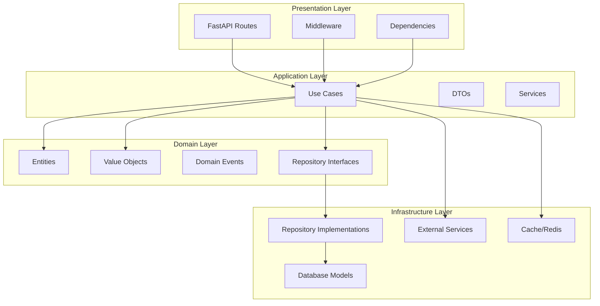
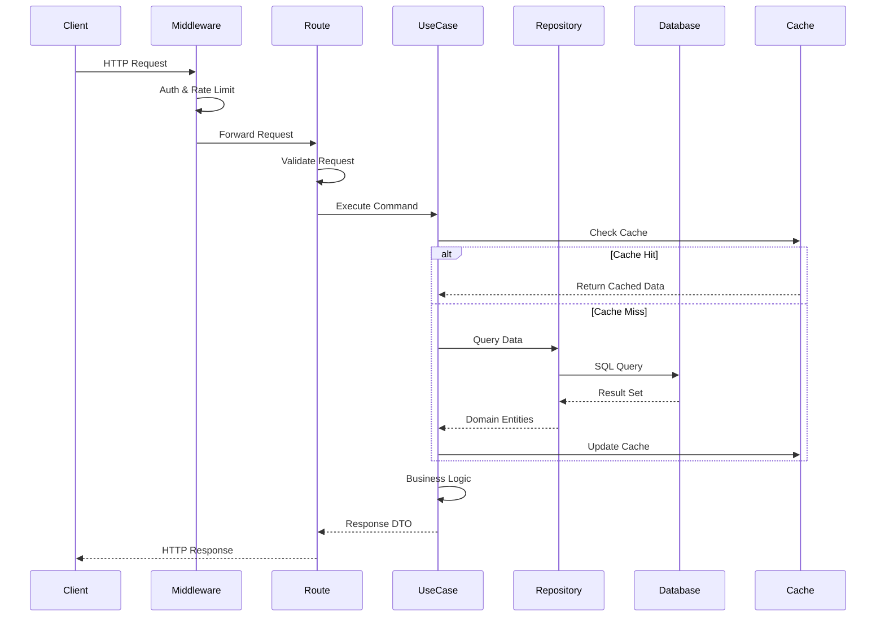
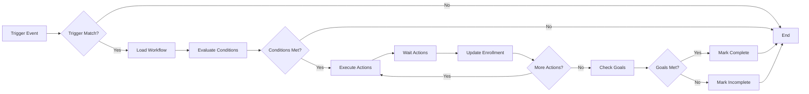
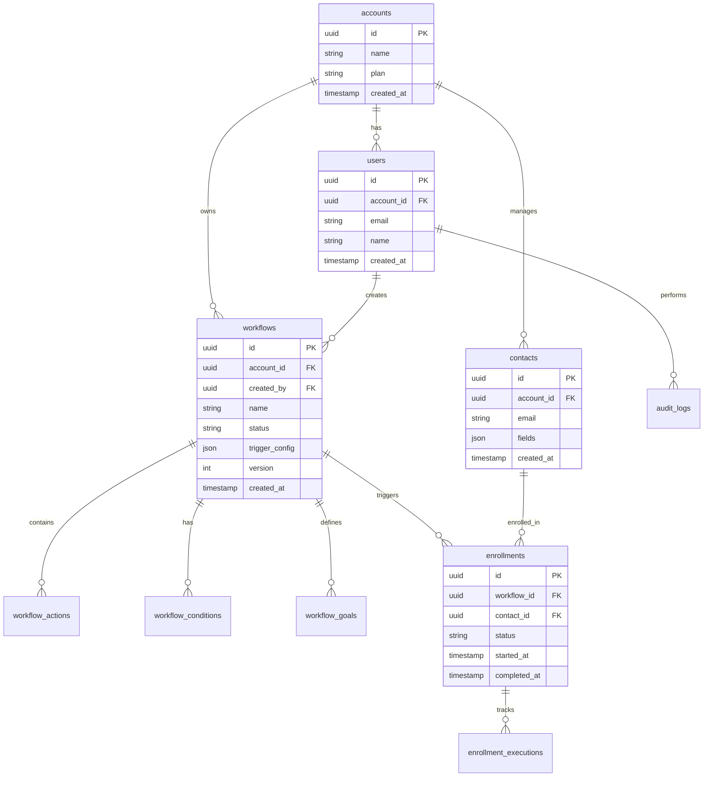
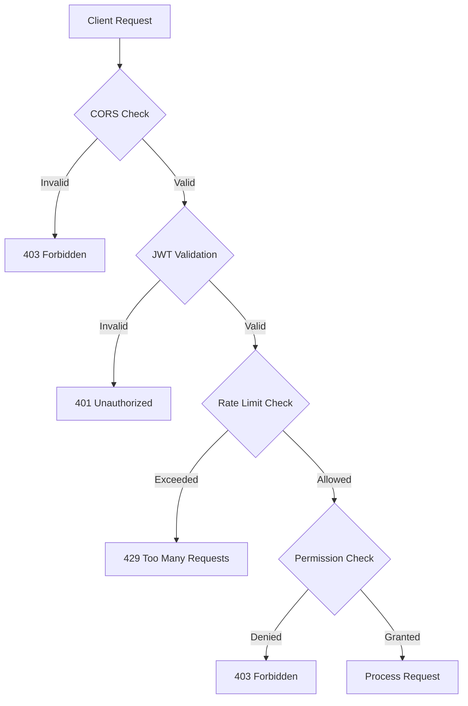

# System Architecture

## Overview

The GoHighLevel Clone platform follows Clean Architecture principles with Domain-Driven Design (DDD) patterns. This architecture ensures separation of concerns, testability, and maintainability.

## Architecture Layers



## Technology Stack

### Backend

| Component | Technology | Purpose |
|-----------|-----------|---------|
| Web Framework | FastAPI 0.115+ | High-performance async API |
| Language | Python 3.12+ | Type-safe, modern Python |
| Database ORM | SQLAlchemy 2.0 async | Database abstraction |
| Database | PostgreSQL 16 | Primary data store |
| Cache | Redis 7 | Caching, rate limiting, sessions |
| Authentication | JWT (python-jose) | Token-based auth |
| Validation | Pydantic 2.10+ | Data validation |
| Migrations | Alembic | Database schema management |
| Testing | pytest, pytest-asyncio | Test framework |
| Code Quality | ruff, mypy | Linting and type checking |

### Frontend

| Component | Technology | Purpose |
|-----------|-----------|---------|
| Framework | Next.js 14.2 (App Router) | React framework with SSR |
| Language | TypeScript 5.4+ | Type-safe JavaScript |
| UI Library | Radix UI | Accessible component primitives |
| Styling | Tailwind CSS 3.4+ | Utility-first CSS |
| State Management | Zustand, TanStack Query | Client state, server state |
| Forms | React Hook Form + Zod | Form validation |
| Charts | Recharts | Data visualization |
| Testing | Vitest, Playwright | Unit, E2E testing |

## Project Structure

```
gohighlevel-clone/
├── backend/
│   ├── src/
│   │   ├── core/                    # Core configuration and utilities
│   │   │   ├── config.py            # Application settings
│   │   │   ├── database.py          # Database session management
│   │   │   ├── dependencies.py      # FastAPI dependencies
│   │   │   └── security.py          # Authentication utilities
│   │   ├── workflows/               # Workflow automation module
│   │   │   ├── domain/              # Domain layer
│   │   │   │   ├── entities.py      # Workflow entities
│   │   │   │   ├── value_objects.py # Value objects
│   │   │   │   └── exceptions.py    # Domain exceptions
│   │   │   ├── application/         # Application layer
│   │   │   │   ├── commands/        # Use case commands
│   │   │   │   ├── queries/         # Use case queries
│   │   │   │   └── dtos.py          # Data transfer objects
│   │   │   ├── infrastructure/      # Infrastructure layer
│   │   │   │   ├── repositories/    # Repository implementations
│   │   │   │   └── models.py        # SQLAlchemy models
│   │   │   └── presentation/        # Presentation layer
│   │   │       ├── routes.py        # API routes
│   │   │       ├── dependencies.py  # FastAPI dependencies
│   │   │       └── middleware.py    # Custom middleware
│   │   ├── crm/                     # CRM module (similar structure)
│   │   └── main.py                  # FastAPI application entry
│   ├── tests/                       # Test suite
│   ├── alembic/                     # Database migrations
│   ├── pyproject.toml               # Python project config
│   └── Dockerfile
│
├── frontend/
│   ├── src/
│   │   ├── app/                     # Next.js App Router pages
│   │   │   ├── workflows/           # Workflow pages
│   │   │   ├── contacts/            # Contact pages
│   │   │   └── layout.tsx           # Root layout
│   │   ├── components/              # React components
│   │   │   ├── ui/                  # Shadcn UI components
│   │   │   ├── workflows/           # Workflow components
│   │   │   └── contacts/            # Contact components
│   │   ├── lib/                     # Utilities and configurations
│   │   │   ├── api.ts               # API client
│   │   │   ├── query.ts             # TanStack Query setup
│   │   │   └── store.ts             # Zustand stores
│   │   └── styles/                  # Global styles
│   ├── package.json
│   └── Dockerfile
│
├── docs/                            # Documentation
├── .github/                         # GitHub Actions workflows
├── docker-compose.yml
└── README.md
```

## Data Flow

### Request Flow



### Workflow Execution Flow



## Database Schema

### Core Tables



## API Gateway Pattern

The backend uses FastAPI with a layered architecture:

1. **Routes Layer**: HTTP endpoints, request validation
2. **Middleware Layer**: Cross-cutting concerns (auth, rate limiting)
3. **Use Cases Layer**: Business logic orchestration
4. **Repository Layer**: Data access abstraction
5. **Domain Layer**: Core business rules

## Multi-Tenancy

Account isolation is enforced at multiple levels:

1. **Authentication**: JWT contains `account_id` claim
2. **Database**: All tables include `account_id` foreign key
3. **Application Layer**: Use cases filter by `account_id`
4. **Row-Level Security**: Database constraints prevent cross-account access

## Caching Strategy

Redis caching is used for:

1. **Rate Limiting**: Per-account request counting
2. **Session Data**: User sessions and tokens
3. **Query Results**: Frequently accessed data
4. **Workflow State**: Active enrollment tracking

Cache invalidation:

- Time-based expiration (TTL)
- Event-based invalidation on updates
- Cache-aside pattern for misses

## Security Architecture



Security features:

- **Authentication**: JWT with RS256 signing
- **Authorization**: Role-based access control (RBAC)
- **Rate Limiting**: Redis-backed per-account limits
- **Input Validation**: Pydantic schema validation
- **CORS**: Configurable allowed origins
- **Audit Logging**: All mutations logged
- **SQL Injection**: SQLAlchemy ORM prevents
- **XSS**: Content Security Policy headers

## Scalability Considerations

### Horizontal Scaling

- **Stateless Application**: FastAPI processes are stateless
- **Load Balancer**: Distribute requests across instances
- **Database Connection Pool**: Reuse connections efficiently
- **Cache Cluster**: Redis Cluster for distributed caching

### Vertical Scaling

- **Async I/O**: Handle concurrent requests efficiently
- **Database Indexing**: Optimize query performance
- **Query Optimization**: N+1 query prevention
- **Memory Management**: Connection pooling limits

## Deployment Architecture

```mermaid
graph TB
    subgraph "CDN"
        CDN[Cloudflare CDN]
    end

    subgraph "Frontend"
        FE1[Vercel Frontend]
    end

    subgraph "Backend"
        BE1[Railway Backend]
        BE2[Backend Instance 2]
    end

    subgraph "Database"
        PG[PostgreSQL]
    end

    subgraph "Cache"
        Redis[Redis Cluster]
    end

    CDN --> FE1
    FE1 --> BE1
    FE1 --> BE2
    BE1 --> PG
    BE2 --> PG
    BE1 --> Redis
    BE2 --> Redis
```

## Monitoring and Observability

1. **Application Logs**: Structured JSON logs
2. **Metrics**: Request rate, error rate, latency
3. **Tracing**: Distributed tracing for requests
4. **Health Checks**: `/health` endpoint for uptime monitoring
5. **Error Tracking**: Exception tracking and alerts

## Technology Choices Rationale

### FastAPI vs. Django REST Framework

**Chosen: FastAPI**

- Async/await support for high concurrency
- Automatic OpenAPI documentation
- Type hints with Pydantic validation
- Better performance (Starlette ASGI)
- Modern Python patterns

### Next.js vs. React SPA

**Chosen: Next.js**

- Server-side rendering (SEO friendly)
- App Router for better routing
- API routes for backend-for-frontend
- Built-in image optimization
- Excellent developer experience

### PostgreSQL vs. MongoDB

**Chosen: PostgreSQL**

- ACID transactions for data integrity
- Complex joins and relationships
- JSON support for flexible schemas
- Mature ecosystem and tooling
- Row-level security for multi-tenancy

### Redis vs. Memcached

**Chosen: Redis**

- Rich data structures (lists, sets, sorted sets)
- Persistence options (RDB, AOF)
- Pub/sub for real-time features
- Rate limiting with atomic operations
- Distributed locking capabilities

## Related Documentation

- [Database Schema](./database.md) - Detailed database design
- [Data Flow](./data-flow.md) - Request and data flow patterns
- [Development Guide](../development/README.md) - Development workflows
- [API Reference](../api/README.md) - Complete API documentation

## References

- [Clean Architecture by Robert C. Martin](https://blog.cleancoder.com/uncle-bob/2012/08/13/the-clean-architecture.html)
- [Domain-Driven Design by Eric Evans](https://www.domainlanguage.com/ddd/)
- [FastAPI Documentation](https://fastapi.tiangolo.com/)
- [Next.js Documentation](https://nextjs.org/docs)
