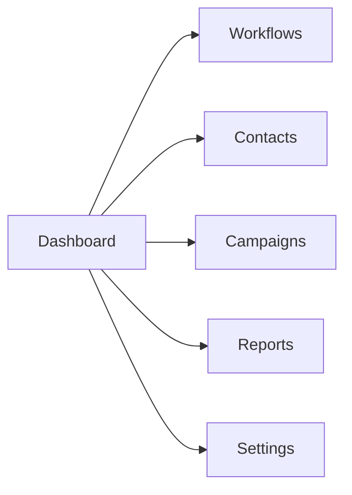

# User Manual

Complete guide for using the GoHighLevel Clone platform.

## Table of Contents

- [Getting Started](#getting-started)
- [Dashboard](#dashboard)
- [Workflows](#workflows)
- [Contacts](#contacts)
- [Campaigns](#campaigns)
- [Reports](#reports)
- [Settings](#settings)

## Getting Started

### Account Setup

1. **Create Account**
   - Visit [app.gohighlevel-clone.com](https://app.gohighlevel-clone.com)
   - Click "Sign Up"
   - Enter email and create password
   - Verify email address

2. **Complete Profile**
   - Add your name and company information
   - Set timezone and date format
   - Configure notification preferences

3. **Integrate Services** (Optional)
   - Connect email provider (SendGrid)
   - Connect SMS provider (Twilio)
   - Connect payment processor (Stripe)

### Navigation



**Main Navigation**:
- **Dashboard**: Overview and quick actions
- **Workflows**: Automation workflows
- **Contacts**: Contact management
- **Campaigns**: Marketing campaigns
- **Reports**: Analytics and insights
- **Settings**: Account configuration

## Dashboard

### Overview

The dashboard provides a quick overview of your account activity and performance metrics.

### Key Metrics

- **Active Workflows**: Number of currently active automation workflows
- **Total Contacts**: Total contacts in your database
- **Enrollments**: Active workflow enrollments
- **Conversion Rate**: Goal completion rate

### Quick Actions

- **Create Workflow**: Start a new automation workflow
- **Add Contact**: Manually add a new contact
- **Launch Campaign**: Start a new marketing campaign
- **View Reports**: Access detailed analytics

### Activity Feed

Recent activity shows:
- Workflow activations
- Contact additions
- Campaign launches
- Goal completions

## Workflows

### What are Workflows?

Workflows are automation sequences that execute actions based on triggers and conditions.

### Workflow Components

**Trigger**: Event that starts the workflow
- Contact added
- Form submitted
- Webhook received
- Scheduled time

**Action**: Step to execute
- Send email
- Update contact
- Wait for duration
- Call webhook

**Condition**: Logic branch
- If contact tag equals "VIP"
- If email opened
- If link clicked

**Goal**: Success criteria
- Email opened
- Link clicked
- Contact replied

### Creating a Workflow

1. **Navigate to Workflows**
   - Click "Workflows" in main navigation

2. **Create New Workflow**
   - Click "Create Workflow" button
   - Enter workflow name (3-100 characters)
   - Add description (optional)
   - Click "Create"

3. **Configure Trigger**
   - Select trigger type from dropdown
   - Configure trigger settings
   - Click "Save"

4. **Add Actions**
   - Click "Add Action"
   - Select action type
   - Configure action settings
   - Click "Save"

5. **Set Goals** (Optional)
   - Click "Add Goal"
   - Select goal type
   - Configure goal settings
   - Click "Save"

6. **Activate Workflow**
   - Review workflow configuration
   - Click "Activate"
   - Confirm activation

### Workflow Status

- **Draft**: Workflow is being configured
- **Active**: Workflow is live and processing triggers
- **Paused**: Workflow is temporarily disabled
- **Archived**: Workflow is hidden from default views

### Managing Workflows

**Edit Workflow**:
1. Click on workflow name
2. Make changes
3. Click "Save"

**Pause Workflow**:
1. Click pause icon next to workflow
2. Confirm pause

**Archive Workflow**:
1. Click archive icon
2. Confirm archive

**Delete Workflow** (Draft only):
1. Click delete icon
2. Confirm deletion

### Workflow Examples

**Welcome Email Sequence**:
```
Trigger: Contact added
Action 1: Send welcome email (immediate)
Action 2: Wait 24 hours
Action 3: Send tips email
Goal: Email opened
```

**Lead Nurturing**:
```
Trigger: Contact tag equals "Lead"
Condition: If lead score > 50
  Action: Send sales email
Else:
  Action: Send nurturing email
Goal: Link clicked
```

**Appointment Reminder**:
```
Trigger: Scheduled (daily at 9 AM)
Condition: If appointment is tomorrow
  Action: Send reminder SMS
Goal: Appointment confirmed
```

## Contacts

### What are Contacts?

Contacts are individuals in your database. They can be customers, leads, or prospects.

### Adding Contacts

**Manual Add**:
1. Navigate to Contacts
2. Click "Add Contact"
3. Enter contact information
4. Click "Save"

**Bulk Import**:
1. Navigate to Contacts
2. Click "Import"
3. Upload CSV file
4. Map columns
5. Click "Import"

**API Add**:
See [Contacts API](docs/api/contacts.md) for details.

### Contact Fields

**Standard Fields**:
- Email (required)
- First name
- Last name
- Phone number
- Company
- Tags
- Status

**Custom Fields**:
- Create custom fields in Settings
- Support for text, number, date, dropdown
- Use custom fields in workflows

### Managing Contacts

**View Contact**:
1. Click on contact email/name
2. View contact details
3. See activity timeline

**Edit Contact**:
1. Click edit icon
2. Update information
3. Click "Save"

**Delete Contact**:
1. Click delete icon
2. Confirm deletion

**Add Tags**:
1. Select contacts
2. Click "Add Tags"
3. Select tags to add
4. Click "Apply"

### Contact Segments

Create segments based on criteria:
- Tag equals "VIP"
- Created after date
- Status equals "Customer"
- Custom field conditions

### Search and Filter

**Search**:
- Search by email, name, phone
- Full-text search across all fields

**Filter**:
- Filter by tags
- Filter by status
- Filter by date range
- Filter by custom fields

## Campaigns

### What are Campaigns?

Campaigns are coordinated marketing activities across multiple channels.

### Campaign Types

- **Email Campaigns**: Send emails to contacts
- **SMS Campaigns**: Send text messages
- **Multi-channel**: Email + SMS combinations

### Creating a Campaign

1. **Navigate to Campaigns**
2. Click "Create Campaign"
3. Select campaign type
4. Enter campaign name
5. Select target audience (segment)
6. Create content
7. Schedule or send immediately

### Campaign Performance

Track metrics:
- Sent count
- Open rate
- Click rate
- Conversion rate
- Unsubscribe rate

## Reports

### Dashboard Reports

Visual overview of key metrics:
- Workflow performance
- Contact growth
- Campaign results
- Goal completion rates

### Workflow Reports

Per-workflow analytics:
- Total enrollments
- Active enrollments
- Completion rate
- Goal achievement
- Drop-off points

### Contact Reports

Contact database insights:
- Total contacts
- New contacts (time period)
- Tag distribution
- Status distribution

### Export Reports

Export reports in:
- PDF (for presentations)
- CSV (for analysis)
- Excel (for spreadsheets)

## Settings

### Account Settings

**Profile**:
- Update name and email
- Change password
- Set timezone

**Company**:
- Company name
- Logo
- Address
- Phone number

### Integrations

**Email Provider**:
- SendGrid API key
- Default sender email
- Sender name

**SMS Provider**:
- Twilio account SID
- Twilio auth token
- Default phone number

**Payment Processor**:
- Stripe secret key
- Currency settings

### Notification Settings

**Email Notifications**:
- Workflow completions
- Error alerts
- Weekly summary

**SMS Notifications**:
- Urgent alerts only

### API Settings

**API Keys**:
- Generate API keys
- Set key permissions
- Revoke keys

**Webhooks**:
- Configure webhook URLs
- Select events to broadcast
- View webhook logs

## Tips and Best Practices

### Workflows

1. **Start Simple**: Begin with basic workflows
2. **Test Thoroughly**: Test with sample contacts before activating
3. **Monitor Performance**: Check workflow reports regularly
4. **Use Goals**: Set goals to measure success
5. **Iterate**: Continuously improve based on data

### Contacts

1. **Keep Clean**: Regularly remove duplicates
2. **Tag Consistently**: Use standardized tag names
3. **Segment Smart**: Create targeted segments
4. **Respect Preferences**: Honor unsubscribe requests
5. **Backup Regularly**: Export contacts periodically

### Campaigns

1. **Personalize**: Use contact names in messages
2. **A/B Test**: Test different subject lines
3. **Time Wisely**: Send at optimal times
4. **Monitor Metrics**: Track campaign performance
5. **Follow Up**: Use automated follow-up sequences

## Troubleshooting

### Workflow Not Triggering

**Possible Causes**:
- Workflow not in Active status
- Trigger conditions not met
- Contact not in target segment

**Solutions**:
- Verify workflow status is Active
- Check trigger configuration
- Test with sample contact

### Email Not Sending

**Possible Causes**:
- Email provider not configured
- Invalid email address
- Daily send limit reached

**Solutions**:
- Check email provider settings
- Verify email address format
- Check send quota

### Contact Not Found

**Possible Causes**:
- Contact deleted
- Search query too specific
- Case sensitivity

**Solutions**:
- Check trash/bin
- Broaden search terms
- Try different filters

## Keyboard Shortcuts

| Shortcut | Action |
|----------|--------|
| `Ctrl/Cmd + K` | Quick search |
| `Ctrl/Cmd + N` | New workflow |
| `Ctrl/Cmd + /` | Keyboard shortcuts |
| `Esc` | Close modal/dialog |

## Support

### Help Resources

- **Documentation**: [docs.gohighlevel-clone.com](https://docs.gohighlevel-clone.com)
- **API Reference**: [api.gohighlevel-clone.com/docs](https://api.gohighlevel-clone.com/docs)
- **Video Tutorials**: [youtube.com/@gohighlevel-clone](https://youtube.com/@gohighlevel-clone)

### Contact Support

- **Email**: support@gohighlevel-clone.com
- **Live Chat**: Available in-app
- **Phone**: +1-555-123-4567 (Premium)

### Community

- **Forum**: [community.gohighlevel-clone.com](https://community.gohighlevel-clone.com)
- **Discord**: [discord.gg/gohighlevel-clone](https://discord.gg/gohighlevel-clone)
- **Twitter**: [@gohighlevelclone](https://twitter.com/gohighlevelclone)

## Changelog

See [CHANGELOG.md](../CHANGELOG.md) for version history and new features.

---

**Version**: 1.0.0
**Last Updated**: 2024-01-15
**Platform**: GoHighLevel Clone
